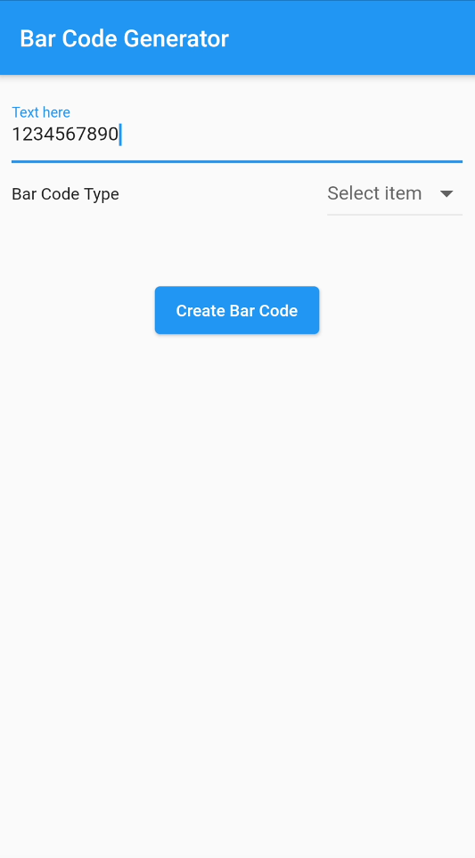
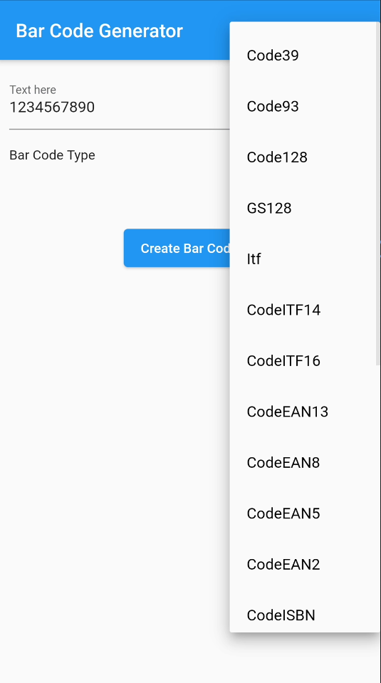
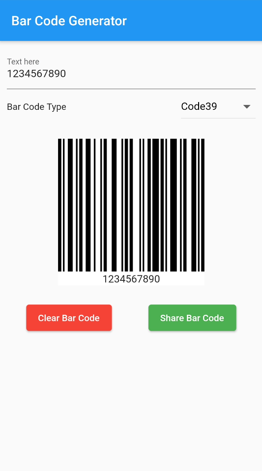
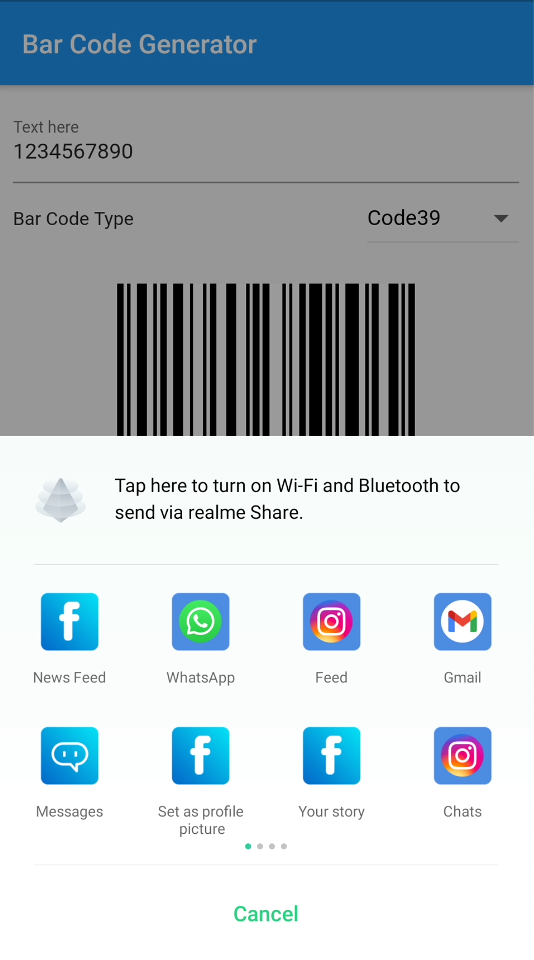

# Bar Code Generator

An implementation of `barcode_widget` to generate Bar Code.


Bar Code Input               |  Bar Code Type Select  |  Bar Code Image  |  Bar Code Share
:-------------------------:|:-------------------------:|:-------------------------:|:-------------------------:
  | | | 


Hey guys! Today we are going to learn about **barcode_widget** package in flutter.

`barcode_widget` is a Flutter library for simple and fast Bar Code generation.

We will be building a simple `Bar Code Generator` app. In this we will be taking text input from user and convert it into Bar Code. Just a small app only for demonstration. No high expectations please. Haha!

Lets begin!!!

## Step 1 :  Install Packages

Place the below dependencies in your `pubspec.yaml` file and run `flutter pub get`
```

  barcode_widget: ^2.0.1

```

This is the main package for demonstration but we will add a few more to add some functionalitites to our app.

```

  esys_flutter_share: ^1.0.2

```


## Step 2 : Declare your variables

We will be needing a few variables as shown below which are self explanatory.

```dart
GlobalKey _globalKey = new GlobalKey();
bool showBarCode = false;
String barCodeText;
BarCodeType barCode;
List<BarCodeType> barCodeTypes = [
BarCodeType('Code39', Barcode.code39()),
BarCodeType('Code93', Barcode.code93()),
BarCodeType('Code128', Barcode.code128()),
BarCodeType('GS128', Barcode.gs128()),
BarCodeType('Itf', Barcode.itf()),
BarCodeType('CodeITF14', Barcode.itf14()),
BarCodeType('CodeITF16', Barcode.itf16()),
BarCodeType('CodeEAN13', Barcode.ean13()),
BarCodeType('CodeEAN8', Barcode.ean8()),
BarCodeType('CodeEAN5', Barcode.ean5()),
BarCodeType('CodeEAN2', Barcode.ean2()),
BarCodeType('CodeISBN', Barcode.isbn()),
BarCodeType('CodeUPCA', Barcode.upcA()),
BarCodeType('CodeUPCE', Barcode.upcE()),
BarCodeType('Telepen', Barcode.telepen()),
BarCodeType('Codabar', Barcode.codabar()),
BarCodeType('Rm4scc', Barcode.rm4scc()),
BarCodeType('QrCode', Barcode.qrCode()),
BarCodeType('PDF417', Barcode.pdf417()),
BarCodeType('DataMatrix', Barcode.dataMatrix()),
BarCodeType('Aztec', Barcode.aztec()),
];
```

The `barCodeTypes` is a custom list of barcode types and their names. The class used is as shown below

```
class BarCodeType {
  String barCodeTypeName;
  Barcode barCodeType;

  BarCodeType(this.barCodeTypeName, this.barCodeType);
}
```

## Step 3 : Take Input

We will be creating a text field whose input will be converted to a Bar Code.

```dart
_buildTextInputField() {
    return TextField(
      onChanged: (text) {
        setState(() {
          showBarCode = false;
          barCodeText = text;
        });
      },
      decoration: InputDecoration(labelText: 'Text here'),
    );
  }
```

Then we will also be creating a dropdown menu for selecting the type of barcode we want to generate.

```dart
 _buildBarCodeType() {
    return Row(
      mainAxisAlignment: MainAxisAlignment.spaceBetween,
      children: [
        Text('Bar Code Type'),
        DropdownButton<BarCodeType>(
          hint: Text("Select item"),
          value: barCode,
          onChanged: (BarCodeType Value) {
            setState(() {
              barCode = Value;
            });
          },
          items: barCodeTypes.map((BarCodeType type) {
            return DropdownMenuItem<BarCodeType>(
              value: type,
              child: Row(
                children: <Widget>[
                  Text(
                    type.barCodeTypeName,
                    style: TextStyle(color: Colors.black),
                  ),
                ],
              ),
            );
          }).toList(),
        ),
      ],
    );
  }
```

## Step 4 : Create Bar Code

The `BarcodeWidget` is used to convet the text into a BarCode. It is from the package we have installed in step 1. The data parms takes the text to be converted.

```dart
_buildBarCode() {
return Padding(
  padding: const EdgeInsets.only(top: 20),
  child: Visibility(
    visible: showBarCode,
    child: RepaintBoundary(
      key: _globalKey,
      child: Container(
        color: Colors.white,
        child: BarcodeWidget(
          barcode: Barcode.code128(),
          // Barcode type and settings
          data: barCodeText ?? '',
          // Content
          width: 200,
          height: 200,
          errorBuilder: (context, error) {
            return Text(error);
          },
        ),
      ),
    ),
  ),
);
}
```

We have wrapped our BarcodWidget into a `RepaintBoundary` so that we can convert it into a image and share it via `esys_share_flutter`.

## Step 5 : Create Buttons

We will be creating 3 buttons. They are Create, Clear, Share as show below.

```dart
_buildButtons() {
return Padding(
  padding: const EdgeInsets.only(top: 20),
  child: Row(
    mainAxisAlignment: MainAxisAlignment.center,
    children: [
      Visibility(
        visible: !showBarCode,
        child: ElevatedButton(
          child: Text('Create Bar Code'),
          style: ElevatedButton.styleFrom(primary: Colors.blue),
          onPressed: () {
            setState(() {
              showBarCode = true;
            });
          },
        ),
      ),
      Visibility(
        visible: showBarCode,
        child: ElevatedButton(
          style: ElevatedButton.styleFrom(primary: Colors.red),
          child: Text('Clear Bar Code'),
          onPressed: () {
            setState(() {
              showBarCode = false;
            });
          },
        ),
      ),
      Visibility(
        visible: showBarCode,
        child: Padding(
          padding: const EdgeInsets.only(left: 50),
          child: ElevatedButton(
            style: ElevatedButton.styleFrom(primary: Colors.green),
            child: Text('Share Bar Code'),
            onPressed: () {
              _barCodeToImage();
            },
          ),
        ),
      )
    ],
  ),
);
}
```

And its done. Thats all for the basic demo of a bar code generator app. You will now be able to create a Bar Code from the input in text field and the type selected from the dropdown. But as you know we will be adding some flavors to our app lets keep going with the flow.

## Step 7 : Sharing the Bar Code

```dart

Now for saving the image to `ByteData` and sharing it we are using the `esys_esys_flutter_share`. First it will convert the widget into a `ByteData`. Then that ByteData is converted into `Unit8List` and later these bytes are shared into .png format. Lets dive into it.

```dart
void _barCodeToImage() async {
    try {
      RenderRepaintBoundary boundary =
          _globalKey.currentContext.findRenderObject();
      ui.Image image = await boundary.toImage(pixelRatio: 3.0);
      ByteData byteData =
          await image.toByteData(format: ui.ImageByteFormat.png);
      var pngBytes = byteData.buffer.asUint8List();
      _shareBarCodeImage(pngBytes);
      setState(() {});
    } catch (e) {
      print(e);
    }
  }

Future<void> _shareBarCodeImage(Uint8List bytes) async {
    try {
      await Share.file('Share Via', 'BarCode.png', bytes, 'image/png',
          text: 'Bar Code');
    } catch (e) {
      print('error: $e');
    }
}
```
This will save the image in Unit8List and open the share intent for you. Now you can select the app in which you want to share this image.

## Step 8 : Assemble all UI

All the UI methods that we have created above are used to build our UI as shown below.

```dart
@override
Widget build(BuildContext context) {
    return Scaffold(
      appBar: AppBar(
        title: Text(widget.title),
      ),
      body: Padding(
        padding: const EdgeInsets.all(10),
        child: Column(
          children: [
            _buildTextInputField(),
            _buildBarCodeType(),
            _buildBarCode(),
            _buildButtons(),
          ],
        ),
      ),
    );
}
```

That's it folks! We're done with all the coding. Just go ahead and run your app!

Fantastic!! You have just learned how to create a BarCode in flutter.

## Important:

This repository is only for providing information on `barcode_widget`. Please do not misuse it.

## Author:

* [Amit Mishra](https://github.com/amitmishra7)

If you like this tutorial please don't forget to add a **Star**. Also follow to get informed for upcoming tutorials.